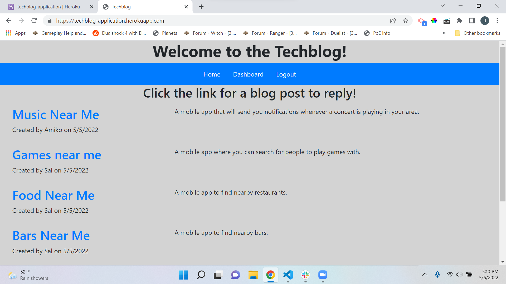

# techblog

## Description
This application is a basic blog site where users can publish blog posts and reply to other people's posts as well.   This app follows the MVC paradigm and uses handlebars.js as the templating language, sequelize as the ORM, and the express-session npm package for authentication.  It also uses bcrypt for encryption and mysql for database management.  

Users are presented with a homepage which includes existing blog posts and a navbar, including a login option.  Once logged in, they have a dashboard and a homepage option.  The dashboard allows them to create, edit, and delete their own posts.  They can also go back to the homepage and click on other users posts to reply to them.  They can click on the posts before being logged in, but they will not see the reply option.  They can logout using the login button, and will eventually be logged out  if they idle for too long using the express-session package.

The application is deployed live to Heroku at the link below.

## Screenshot

## Links
\* Here is the link to the repo [techblog/repo] (https://github.com/Jasonsburke90/techblog)

Here is the link to the heroku app [techblog/heroku] (https://techblog-application.herokuapp.com/)